```bash
wget https://www.encodeproject.org/files/ENCFF918VFL/@@download/ENCFF918VFL.bed.gz

wget https://www.encodeproject.org/files/ENCFF678VNN/@@download/ENCFF678VNN.bed.gz

cat bed_files | xargs -tI{} bash -c 'zcat {}.bed.gz  |  cut -f1-5 > H3K9me3_H1.{}.hg38.bed'

cat bed_files | xargs -tI{} bash -c 'liftOver   data/H3K9me3_H1.{}.hg38.bed   hg38ToHg19.over.chain.gz   H3K9me3_H1.{}.hg19.bed   H3K9me3_H1.{}.unmapped.bed'
```

# Анализ пиков гистоновой метки

Распределения длин:

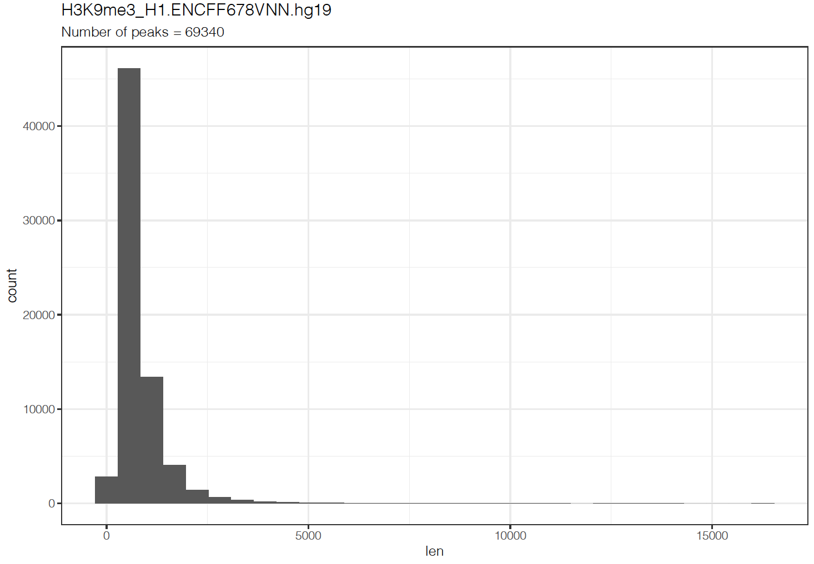

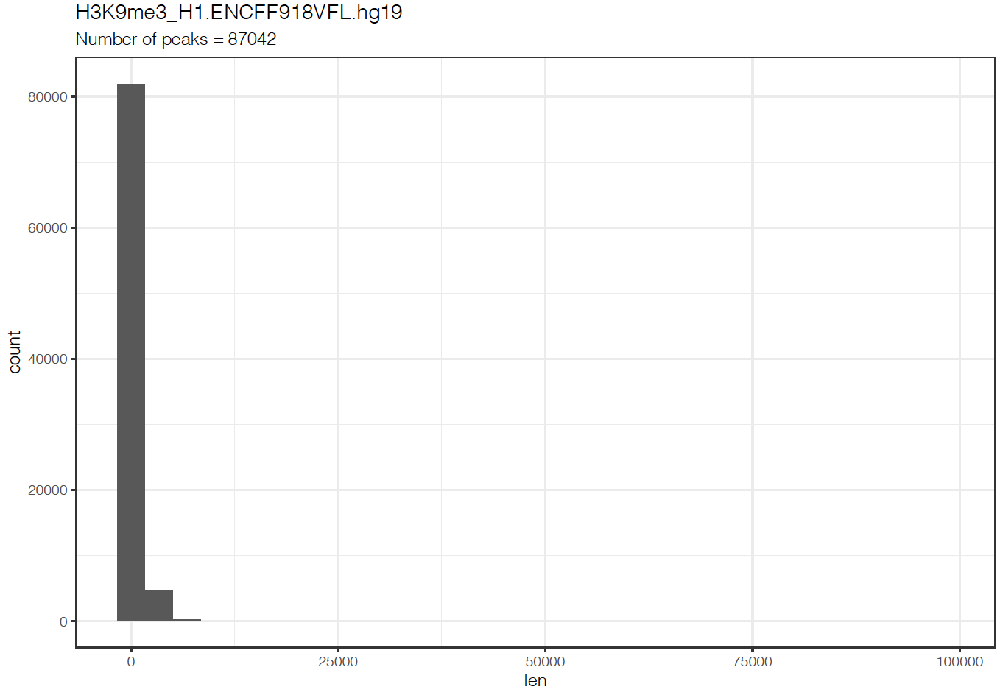


Количество пиков **до фильтрации**:

* ENCFF678VNN: 69340
* ENCFF918VFL: 87042

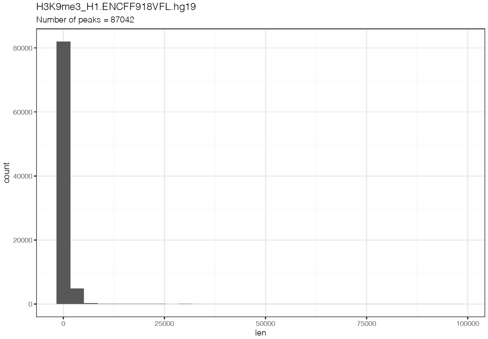

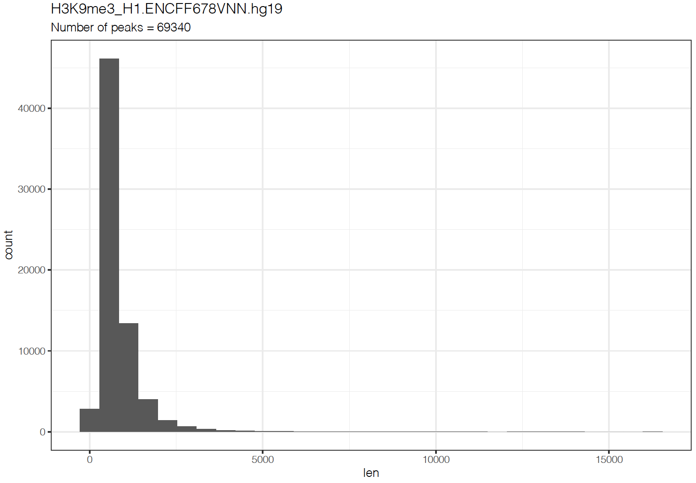

Количество пиков **после фильтрации**:

* ENCFF678VNN: 69129
* ENCFF918VFL: 86674

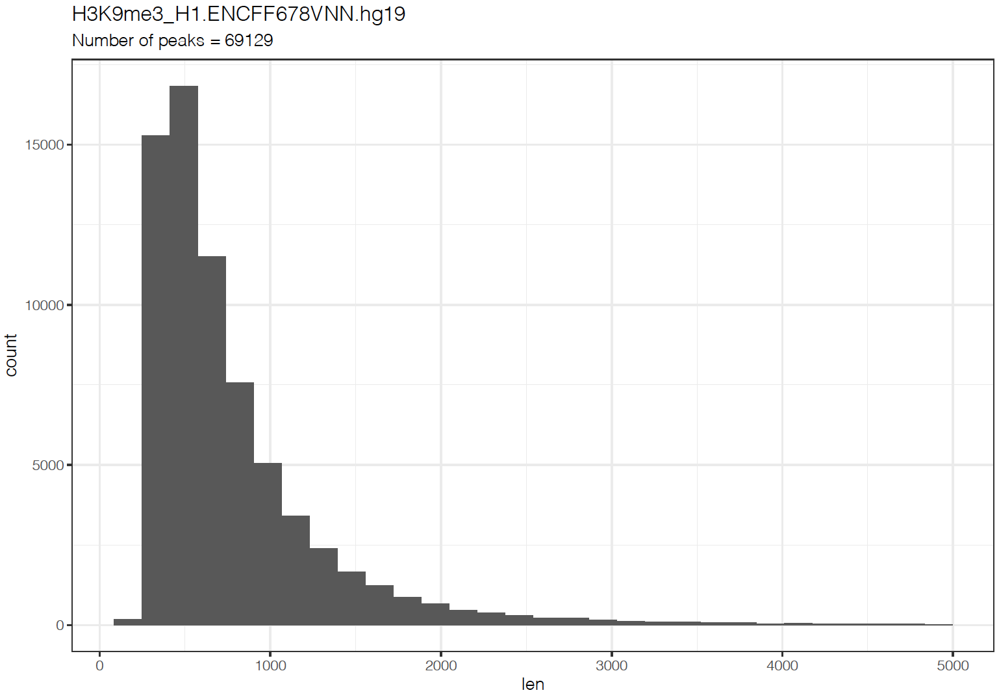

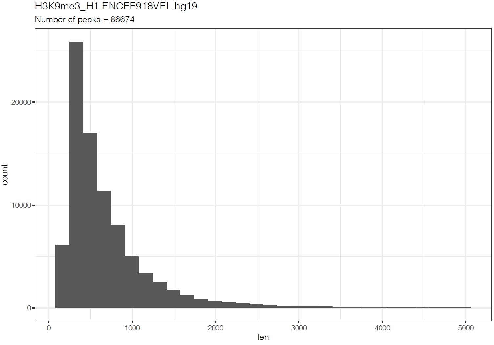


Пайчарты:

* ENCFF918VFL

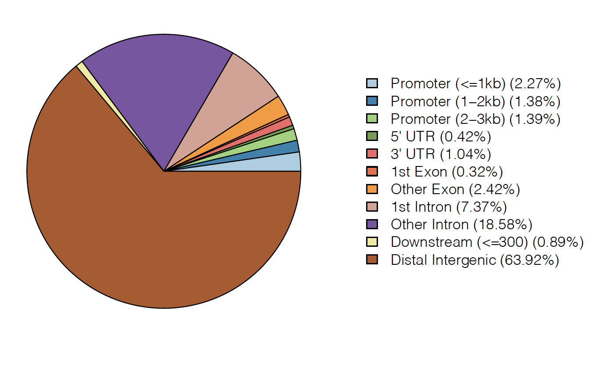

* ENCFF678VNN

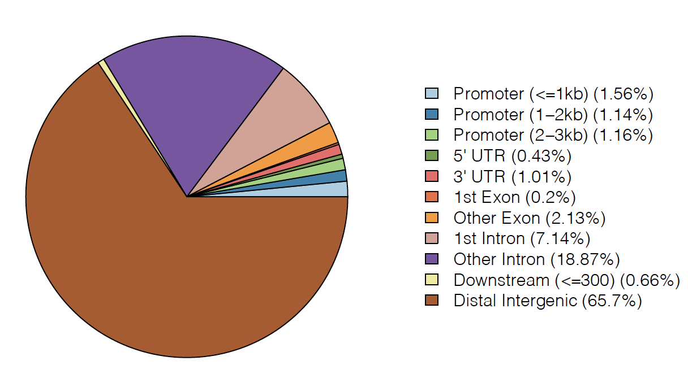

```bash
track visibility=dense name="ENCFF678VNN"  description="H3K9me3_H1.ENCFF678VNN.hg19.fitered.bed"
https://raw.githubusercontent.com/kekekekule/hse21_H3K9me3_ZDNA_human/master/data/H3K9me3_H1.ENCFF678VNN.hg19.filtered.bed

track visibility=dense name="ENCFF918VFL"  description="H3K9me3_H1.ENCFF918VFL.hg19.fitered.bed"
https://raw.githubusercontent.com/kekekekule/hse21_H3K9me3_ZDNA_human/master/data/H3K9me3_H1.ENCFF918VFL.hg19.filtered.bed

track visibility=dense name="ChIP_merge"  description="H3K9me3_H1.merge.hg19.fitered.bed"
https://raw.githubusercontent.com/kekekekule/hse21_H3K9me3_ZDNA_human/master/data/H3K9me3_H1.merge.hg19.bed
```


Визуализация `.bed` файлов в геномном браузере:

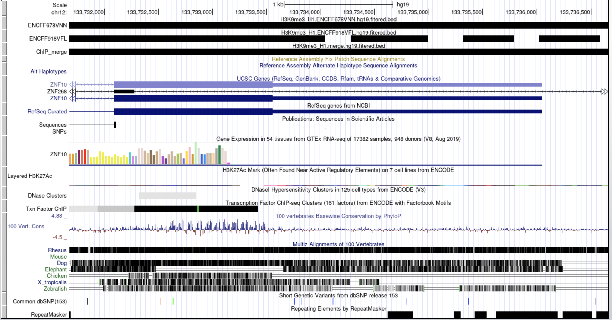


# Вторичная структура

```bash
wget https://raw.githubusercontent.com/Nazar1997/DeepZ/master/annotation/DeepZ.bed
```

Пайчарт для DeepZ:

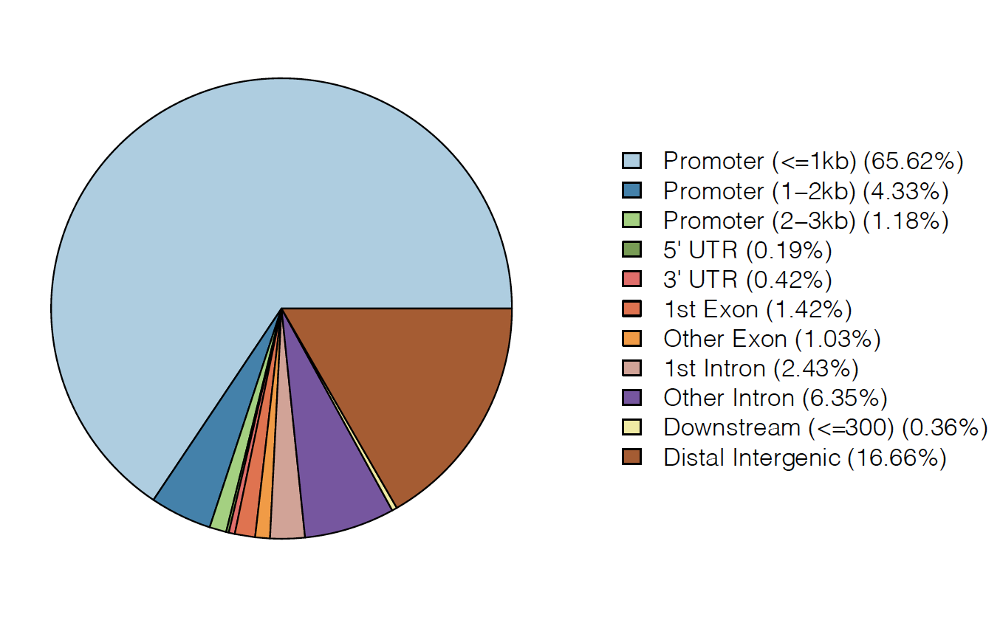


Сессия: http://genome.ucsc.edu/cgi-bin/hgSession?hgsid=1123636785_MVfXqwZJ1TNDAhRQL7DTGLRzuia2&hgS_doMainPage=1

```bash
wc -l data/H3K9me3_H1.intersect_with_DeepZ.bed
```

Количество пересечений: 1051.

Примеры пересечений (на скриншотах немного сделан zoom out):

* chr1	1168014	1168111
* chr2	10835	10876

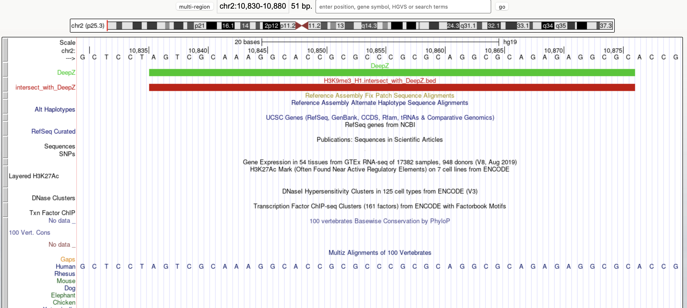

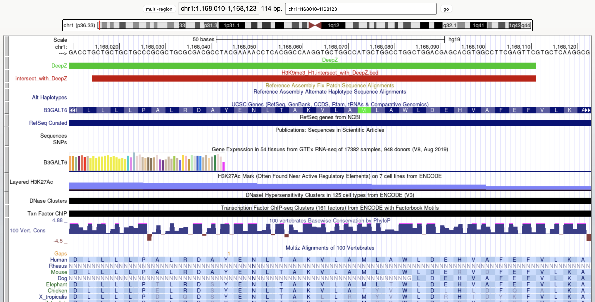


Ассоциируем пересечения:

```bash
wc -l H3K9me3_H1.intersect_with_DeepZ.genes.txt
wc -l H3K9me3_H1.intersect_with_DeepZ.genes_uniq.txt
```

Получили 94 уникальных гена и всего 132 проассоциированных.


# PantherDB

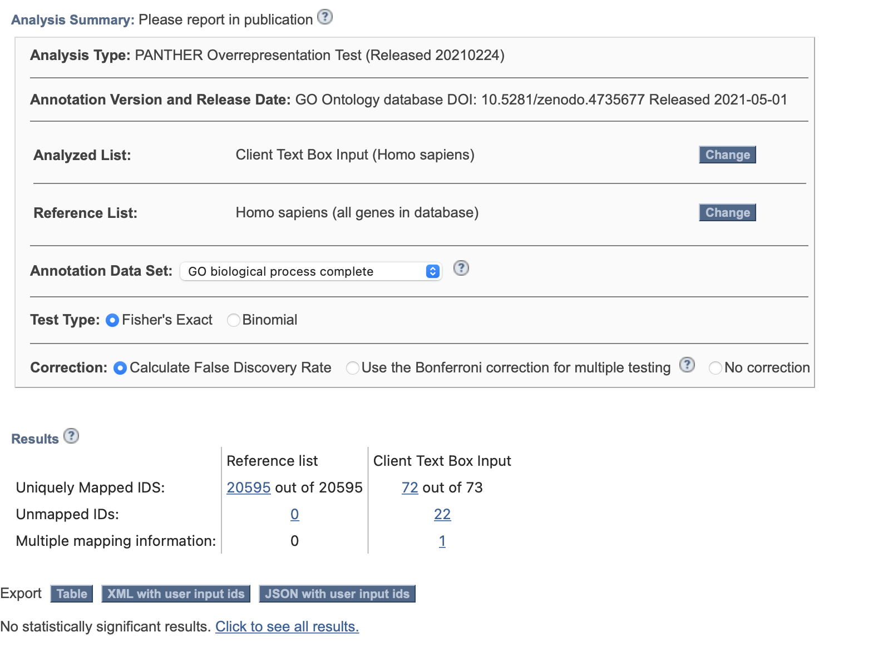

Как можно видеть, статистически значимых результатов нет. У нас гистон связан с гетерохроматином, который находится вне генов, поэтому, вероятно, так и происходит.